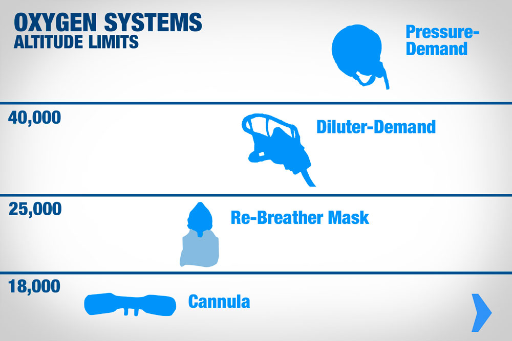
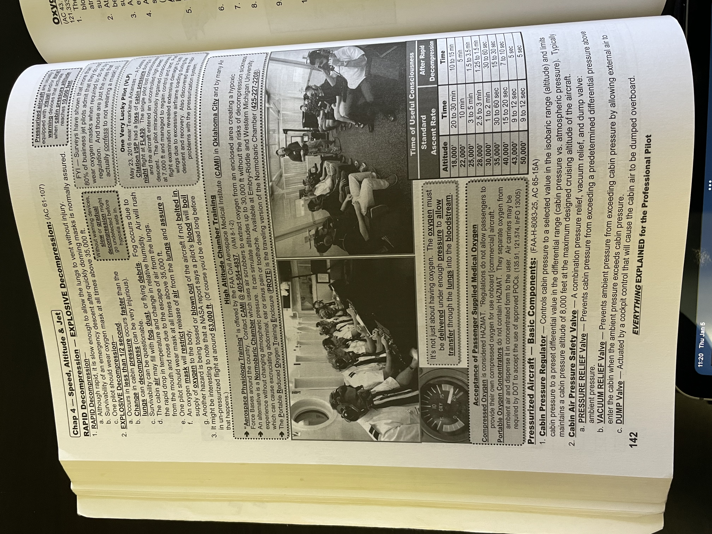
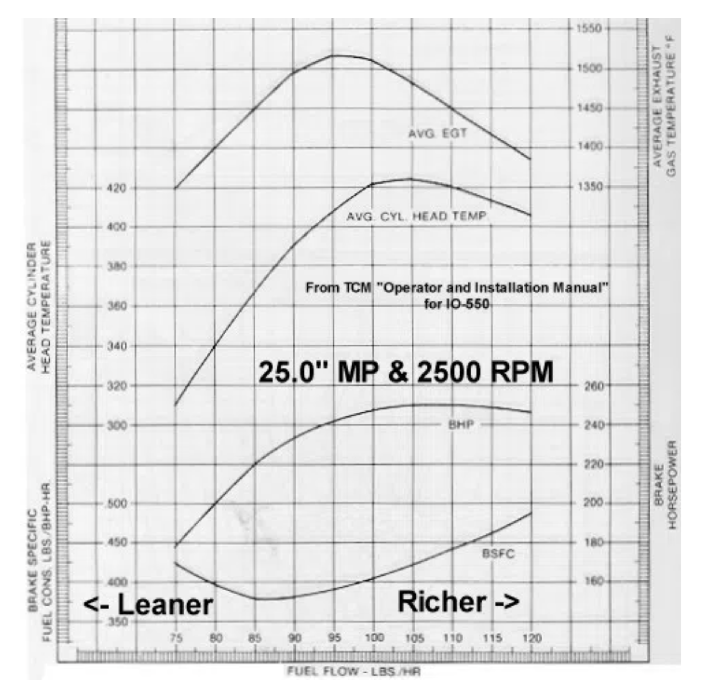

# Oral Exam Notes

## Operating for hire
* 3 P's
  * Pilot
  * Plane
  * Paid
* Must have all three to be illegal; good with one or two

## Oxygen delivery
* Goal: increase partial pressure of oxygen in your lungs
  * Increase percentage of oxygen in the air
    * This works up to about FL400
  * Add pressure to force oxygen through lungs' membranes
* Three systems:
  1. **Continuous flow**
    * Portable oxygen, airplane is limited to FL250
    * Standard for light aircraft
    * Air flows continuously to your nose and mouth
    * Pushes too much oxygen at low altitude and is wasteful
    * All are limited up to 25,000 feet
    * Altitude adjustable
      * Some systems allow you to vary rate of oxygen flow, i.e. dial in an altitude
      * Sometimes can specify on a per-mask basis
    * Altitude compensating
      * Automatically adjusts the oxygen flow rate as you climb or descend
    * **Types of delivery**
      * *Cannula*
        * Light but limited to 18,000 feet by FARs
        * Not as effective if you talk or breathe through mouth a lot
      * *Rebreather*
        * Limited to 25,000 feet
        * Mask that fits over your face
        * Seal is not airtight, but significantly increases oxygen percentage
        * May have built-in microphone
        * Only delivers oxygen on inhale, not on exhale
      * *Airline drop-down units* (Dixie cup)
        * May also be phase-dilution or phase-sequential
        * Rated for emergency use up to 40,000 feet
        * Bag fills with 100% oxygen, flows into mouth on inhale, if bag empties then second one-way valve lets in cabin air
        * Expired air vented out of mask into cabin via one-way valve
  2. **Diluter demand**
    * Airplane limited to FL400
    * Face-tight seal to ensure cabin air doesn't unintentionally mix into mask
    * Automatically mixes cabin air with oxygen to maintain safe oxygen saturation
    * Only supplies oxygen as you breathe; doesn't continuously pump oxygen like continuous delivery
    * Lasts longer than continuous flow
    * Above 40,000 feet, not enough atmospheric pressure even with 100% O2 to allow lungs to absorb safe levels of oxygen
    * **Types of delivery**
      * *Quick-don*
        * Rated up to 40,000 feet
        * Must have capability to be donned in 5 seconds or less
        * Usually used by flight deck crew
  3. **Pressure demand**
    * Airplane goes above FL400
    * Forces pressurized 100% oxygen into lungs as you breathe
    * Must force exhale since system forces air into lungs under pressure
    * Fatiguing after several hours
* **FAR 91.211**
  * Above 12,500 and up to and including 14,000 MSL: oxygen required for flight time over 30 minutes
  * Above 14,000 MSL: oxygen required
  * Above 15,000 MSL: all occupants provided oxygen
  * Above FL250: at least 10 minute supply of oxygen available for each occupant in the event of an emergency descent due to depressurization
  * Above FL350: at least one pilot at the controls is wearing and using an oxygen mask that is secured and supplies oxygen at all times or whenever cabin pressure exceeds 14,000 MSL
    * No need to wear oxygen mask below FL410 if two pilots at the controls and each pilot has a quick donning mask
    * Remaining pilot must put oxygen mask on if one of the pilots must leave their station until they have returned
  * No need to wear mask while flying single-pilot under Part 91 when cabin altitude stays at or below 35,000 feet
  * Diluter-demand mask usually needed as a backup (quick-don)
  * See Aircraft Pressurization for more details
* See [this Boldemethod article](https://www.boldmethod.com/learn-to-fly/aircraft-systems/oxygen-systems/#:~:text=The%20Systems%20%2D%20Continuous%20Flow%2C%20Diluter,are%20meant%20for%20different%20altitudes.)

## Common Carriage
 * Wet lease
   * Lessor of aircraft also provides crew; lessor has operational control
 * Dry lease
   * Lessee of aircraft provides crew; lessee has operational control
* **A common carrier:** (AC 120-12A)
  1. Demonstrates a *holding out* of a willingness to
  2. Transport persons or property
  3. From place to place
  4. For compensation
  * Examples include advertising, willingness (or reputation) to offer transportation to all who want it, agents/salesmen advertising services
* Private carriers
  * Also known as contract carriers
  * Includes carriage for one or several selected customers generally on a long-term basis
    * Generally these contracts must not exceed 18 to 24 else they indicated a willingness to make a contract with anybody (holding out)
* Generally willing to carry only certain kinds of traffic is indicative of a common carrier
* Carrier flying charters for only one organization but the organization is open to a significant segment of the public is a common carrier
* Carrier that is flying for a common carrier is itself a common carrier
* Offers of free transportation are also common carriage since passengers are drawn from the general public
* Very rare for a common carrier to be allowed to clasify some operations as private carriage simply because they differ from their typical common carriage operations
  * Must demonstrate that this carriage would be clearly distinguishable from their common carriage and outside the scope of its holding out

## Aircraft Pressurization
* Oxygen masks prevent hypoxia but do not help with sinus or ear blocks or decompression sickness
* Pressurized air typically obtained from the aircraft's turbocharger or compressor section
  * Piston-powered aircraft may use air supplied from each turbocharger through a sonic venturi
  * Turbine-powered aircraft use air supplied from the compressor stage of the engine
* Typical cabin pressure altitude maintained is 8000 feet at maximum designed cruising altitude of an aircraft
  * Air is exchanged reasonably fast from inside to outside of cabin
* Cabin pressure regulator
  * Controls cabin pressure to a selected value and limits cabin pressure to a preset differential value
  * After aircraft reaches altitude at which differential is highest for which fuselage is designed, a further increase in aircraft altitude will increase cabin altitude
* Valves
  * Outflow valve
    * Allows for air to exit the cabin at a controlled rate which results in the cabin becoming pressurized
    * **Begins closing until max cabin differential pressure is reached; thereafter, cabin altitude begins to climb**
      * Cabin rate of climb is slightly less than airplane rate of climb
  * Safety/dump valve
    * Combination pressure relief, vacuum relief, and dump valve
    * If the outflow valve fails, this will release excess pressure (can be manually activated) by a squat switch to prevent pressurization on the ground
    * Dump valve dumps cabin air into atmosphere
  * Vacuum relief valve
    * Allows ambient air into the cabin
    * Prevents ambient pressure from exceeding cabin pressure by allowing external air to enter cabin
* Generally, fuselage is designed to withstand a particular maximum cabin differential pressure
* Sonic venturi
  * Limits amount of air taken from turbocharger by accelerating air to sonic speeds, creating a shock wave which acts as a barrier
  * Air is cooled (it is very hot) and then sent to cabin vents
* Controls
  * Cabin pressure control: pilot selects altitude pressurization begins and can preset rate at which it pressurizes
  * Differential range system: prevents exceeding differential pressure limits
  * Isobaric range: maintains a preset cabin atmosphere
* Decompression
  * Caused from equipment failure or structural damage
  * Decompression sickness (the Bends) is also possible
  * **Gradual decompression**: dangerous because it may be hard to detect until already suffering hypoxic symptoms
  * **Rapid**
    * Lungs decompress faster than cabin so no likelihood of lung damage
    * Usually happens in 1-10 seconds
    * Cabin fills with fog because of condensation of water vapor
    * Cabin becomes cold
    * 12 seconds of useful consciousness at high altitudes
    * As a result, at high altitudes (> FL350), recommended to wear oxygen mask and select 100% oxygen for pressure demand oxygen systems
  * **Explosive**
    * Occurs faster than the lungs can decompress (lungs take about 0.2 seconds)
    * General from material fatigue or engineering failure
    * Anything less than 0.5 seconds is considered explosive decompression
    * Also causes cloud to form; may cause passengers to feel dazed
* Malfunctions
  * Outflow valve stuck open: cabin will not pressurize
  * Cabin fails to decompress: safety valve should decompress aircraft
* **Regulations for pressurized aircraft**
  * See 14 CFR 91.211
  * Above FL250, must have at least a 10 minute supply of supplemental oxygen for each occupant in addition to any other requirements of this section
  * Above FL350, one pilot must wear and use an oxygen mask that either supplies oxygen at all times or when cabin altitude exceeds 14,000 feet
    * Except when under FL410 if two pilots at controls and each pilot has a quick-don mask that can be placed on face with one hand from ready position within 5 seconds
  * If above FL350 and one pilot needs to leave the controls, the reamining pilot must put on and use the oxygen mask until the other pilot has returned

## Miscellaneous
* Flight reviews are recorded as follows:
  * Signed log entry
  * Endorsement
  * IACRA encouraged
* Temporary Airman Certificate
  * Lasts 120 days
* Temporary Aircraft Registration
  * Lasts 90 days
* Aircraft Registration
  * Lasts 36 calendar months (7 years after 1/23/23)
* Search and rescue is initiated if you fail to report or cancel flight plan within 30 minutes after ETA

## Aeromedical
* Spatial disorientation: inability of a pilot to correctly interpret aircraft attitude, altitude or airspeed in relation to the Earth or other points of reference
  * See [this Quizlet](https://quizlet.com/655014569/ifr-illusions-flash-cards/)
* Heatstroke
  * Body unable to cool down
  * Body temp in excess of 106F
  * Confusion, loss of consciousness, sweating, seizures

## Weather
* Turbulence types
  * Convective
  * Mechanical
  * Wind shear
* Icing levels
  * Trace
  * Light
  * Moderate
  * Severe
* Clouds
  * Cirrus
    * Higher altitudes (generally above 20,000 feet)
    * Wispy
    * White or light grey in color
  * Stratus
    * Layered, horizontal clouds
    * Wide range of shading
  * Cumulus
    * Fluffy
  * Nimbus
    * Heavy or violent precipitation
    * Cumulonimbus: thunderstorm
  * Grouped according to shape, behavior, altitudes:
    * Low clouds (stratus)
      * Surface to 6500
      * Stratus, nimbostratus, stratocumulus
    * Middle clouds (alto)
      * 6500 to 25000
      * Water or ice crystals, super-cooled water
      * Altostratus, altocumulus
      * May contain turbulence and potential severe icing
    * High clouds (cirrus)
      * 20000 to 50000
      * White or light gray, primarily composed of ice crystals
      * Seldom pose serious turbulence or icing hazard
      * Cirrus (usually above 20000), cirrostratus (low moisture, usually no icing), cirrocumulus (may produce light turbulence)
    * Clouds with vertical development
      * Turbulent
      * Cumulus, towering cumulus (turbulence and icing), cumulonimbus
    * Others
      * Lenticular (leeward side of mountains)
      * Cap clouds
      * Rotor clouds (turbulence, extreme updrafts followed by extreme downdrafts)
      * Roll and wall clouds (severe thunderstorms)
  * Different types of lifting:
    * Convergence
    * Orographic
    * Frontal
    * Thermal
* Standard pressure lapse rate: 1" Hg per 1000 feet up to 10000 feet

## Aerodynamics
* An aircraft in steady flight doubles its speed
  * Parasite drag increases 4x
  * Power required to overcome that parasitic drag is 8x
  * Induced drag decreases 4x (is 0.25x original)
  * Power required to overcome that drag is 0.5x the original value
* Service ceiling: maximum density altitude where the best rate-of-climb airspeed will produce a 100 fpm climb at maximum weight in a clean configuration with maximum continuous power
* Absolute ceiling: altitude at which climb no longer possible
* Minimum sink speed is usually a few knots less than best glide
* Best glide speed is usualy about halfway between VX and VY
* **Good rule of thumb: can glide about 1.5nm per 1000 feet of altitude lost AGL**
* Forward center of gravity
  * Higher stall speed
  * Slower cruise speed
  * More stable
* Rearward center of gravity
  * Lower stall speed
  * Higher cruise speed
  * Less stable
* Center of pressure: where aerodynamic forces of lift are concentrated
  * If CG is forward of CP, natural tendency of aircraft to pitch down
  * If CG is aft of CP, natural tendency of aircraft to pitch up
    * Generally, aft limit of the CG is fixed forward of the CP to maintain flight equilibrium and prevent this from happening
* %MAC (Mean Aerodynamic Chord)
  * How CG is expressed in larger aircraft
  * Aircraft has acceptable flight characteristics if CG is located somwhere near 25 %MAC (i.e. CG is located one-forth of the total distance back from the leading edge of the average wing section)
* Elevator effectiveness decreases in ground effect, increases effort required to raise the nose
* **Factors that affect airplane performance**
  * Atmospheric conditions (ambient temperature, **density altitude**, elevation)
    * Humidity (reduces amount of air available for combustion)
  * Surface contamination (i.e. frost)
    * Aircraft surface temperature (indicates susceptibility of aircraft to icing)
  * Weight and balance (location of CG compared to center of pressure, proper loading)
    * Also instability about lateral axis (i.e. uneven fuel tank levels, uneven loading)
  * Proper engine management
  * Wind conditions (headwind, tailwind, crosswind, gusts)
  * Ground effect
  * Wake turbulence
  * Gross weight of aircraft (i.e. extra passengers or baggage)
  * Surface condition of runway (i.e. paved runway vs. grass)
  * Equipment issues (i.e. underinflated tires that increase drag on wheels, dirt or sticky brakes)

## Constant speed propeller
* Most single engine constant speeds have a very powerful spring that drives the blades to flat pitch/low RPM and oil pressure is used to oppose that force
  * Thus, single engines fail to full low pitch (power) prop
* Twins are opposite; hub of prop in a twin contains a powerful spring that drives the prop towards high pitch/low RPM
  * Opposed by governor oil pressure
  * Thus, failure in light twin drives prop into feather
  * However, light twins do not feather on normal shutdown, as this would cause for excessive mechanical strain on startup before enough oil pressure was developed to unfeather
  * Thus, props in piston twins have centrifugal latches that lock the blades in a medium pitch position under ~600 RPM on normal shutdown; during inflight loss of oil pressure, windmilling action prevents these from engaging and prop fails to feathered position

## Weight and Balance
* Aft CG
  * Decreased down force necessary by tailplane to counteract lift
  * Decreases induced drag
  * Increases airspeed
  * Increases lift
  * Increases lateral instability / stall recoveyr
* Forward CG
  * Greater flight stability
  * Increases drag due to increased down force necessary by tailplane
    * Can limit maneuverability and case pancake landing (think nose-heavy 182s)

## Leaning
* Lean to max CHT and you will essentially lean to max power for that MP/RPM setting
* Why reduce manifold pressure before reducing RPM, and increasing RPM before you increase manifold pressure?
  * At high power setting with a low RPM, peak pressure in the cylinder will be much higher. This is because the shaft travels a lesser distance (since it has less RPMs) after ignition prior to TDC (Top Dead Center), so the size of the combustion chamber is smaller when PPP (Peak of Pressure Pulse) occurs. This means a higher pressure and thus higher temperature, which is bad for the engine and increases the risk of detonation
  * Good rule to abide by always but generally only applies to high power settings
* Why take off with full rich?
  * Most important: Rate of combustion is faster with a leaner mix, which brings PPP closer to TDC
  * Beneficial side effect of taking the above into account: willing to sacrifice extra fuel to maximize cooling of engine at high RPM setting that usually is not set for long
  * Assures that detonation will not occur
* **Do not let CHT ever get above 400F!** Allow about 20 degrees of buffer too
  * Increase air speed, open cowl flaps slightly, or enrich mixture if on rich side (or lean more if on lean side) to get CHT back down
  * Using more fuel is a last resort solution
* What causes roughness when leaning engine?
  * The first cylinder to peak and start down on the lean side will produce less power than the others, and unequal power from one cylinder (or more) will cause enough vibration to be obvious
  * Thus, can't run lean of peak because uneven mixture distribution in most engines causes them to run too rough
* High power, maximum performance operation: richer mixture and higher RPMs
* Low power, maximum efficiency operation: leaner mixture and lower RPMs
* Lean mixture does not cause corrosion in exhaust stacks

## Maneuvers
* If an airplane is skidding towards the outside of a steep turn, the inside wing will stall first, creating tendency to roll to the inside of the turn
* Overbanking tendency is caused by difference in lift between inside and outside wings
  * Outside wing moves through slightly larger circumference than inside wing
  * Thus, has slightly higher airspeed, and thus generates slightly more lift
  * More pronounced the steeper the turn is because it is balanced out by lateral stability more effectively at shallower banks

## Normal and Utility Category
* Normal: +3.8, -1.52 Gs
* Utility: +4.4, -1.76 Gs
* Aerobatic: +6, -3 Gs

## More Commercial stuff
* When is a flight for compensation or hire?
  * No common purpose (having a reason to fly to a particular destination) AND I am exercising "operational control" of the flight
OR
  * There is compensation in excess of my pro-rata share
* Drug testing is required for pilots of any passenger-carrying flight for compensation or hire
* Inop equipment
  1. MEL?
  2. VFR/IFR day/night required equipment?
  3. Required for type certificate?
  4. Required by KOEL?
  5. Required by AD?
  6. Do you think you can fly safely without it?
  7. Deactivate and placard it
* 10 hour grace for 100 hr inspection does not require to ADs that have come due at "next regularly scheduled inspection"
* Scenario-based questions: ask yourself, "how did we get into this situation?"
* Runway weights on chart supplement
  * S-75 says it will support Single Wheel Main Landing Gear up to 75,000 pounds.
  * D-95 says double wheel mains can go up to 95,000
  * 2D-130 says two wheels in tandem landing gear up to 130,000.
* Turbocharger uses exhaust gas to power turbine; supercharger is directly connected to the crankshaft
* SCUBA
  * AIM 8-1-2
  * Wait 12 hours, or if going above 8,000/had controlled ascent, 24 hours
* 4 left-turning tendencies
  * P-Factor
    * Descending blade has a slightly higher AOA than ascending blade, and thus produces slightly more thrust
  * Torque
  * Spiraling slipstream
  * Gyroscopic precession
    * Only present with pitch change (rotation, level off)
    * Tailwheel plane rotate
    * Applied force is experienced 90 degrees in direction of rotation
  * When are left-turning tendencies most pronounced?
    * Low airspeed
    * High AOA
    * High thrust

