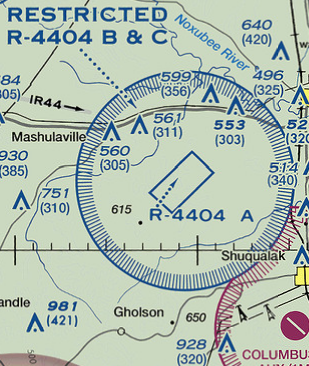
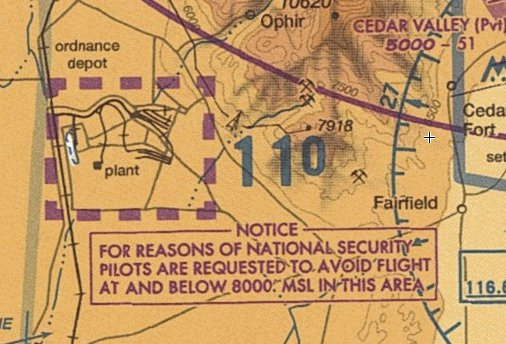
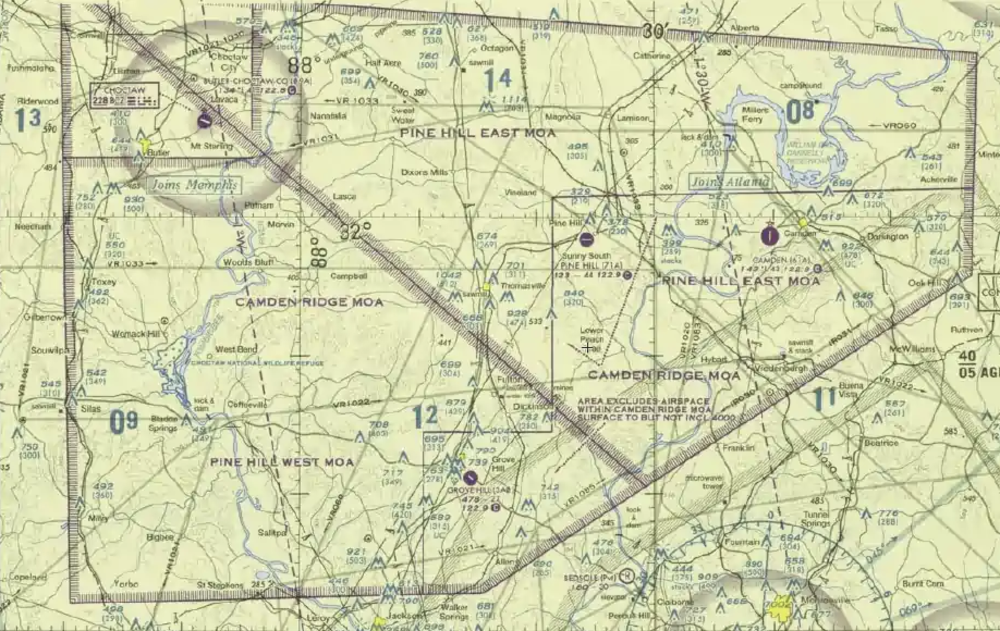
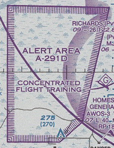
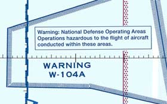

# Special Use Airspace

* Restricted Airspace
  * Flight not wholly prohibited, but is subject to restrictions
  * Contain unusual, often invisible hazards to aircraft like artillery firing or gunnery
  * Regulatory in nature and published in 14 CFR Part 73
  * Denoted by R and number
  * Have altitude, time of use, and controlling agency/contact facility

* National Security Areas (NSAs)
  * Requirement for increased security and safety of ground facilities
  * Depicted inside magenta dash, similar to class E but larger
  * Special instructs are written on sectional chart
  * Pilots asked to voluntarily avoid flying through an NSA
  * Prohibitions issued by NOTAM where required

* Military Operationg Areas (MOAs)
  * Established to separate military training activities from IFR traffic
  * Activities in an MOA may include air combat tactics, interceipts, aerobatics, formation training
    * May have flight in excess of 250 knots below 10,000 feet
  * Non-regulatory and do not require pilot participation
  * VFR flight should exercise extreme caution
  * Pilots should contact controlling agency when operating within 100NM of the MOA

* Controlled Firing Areas (CFAs)
  * Contain activities which could be hazardous to non-participating aircraft
  * Activities discontinued when a spotter aircraft/radar/ground personnel determine an aircraft is approaching the area
  * Non-regulatory and not charted

* Alert Area
  * Depicted to inform nonparticipating pilots of areas that may contain high volumes of pilot training, parachute jumping, glider towing, or other unusual aerial activites
  * Non-regulatory
  * Pilots urged to exercise extreme caution
  * Charted as an `A` followed by a number

* Warning Area
  * Sections of airspace that may contain activities that may be hazardous to non-participating aircraft
  * Warn nonparticipating pilots of potential danger
  * May be located or domestic or international waters or both
  * Extend from 3 nautical miles and outwards from the coast of the United States
  * Depicted on VFR sectionals, TAC, and IFR En-Route Low Altitude charts

