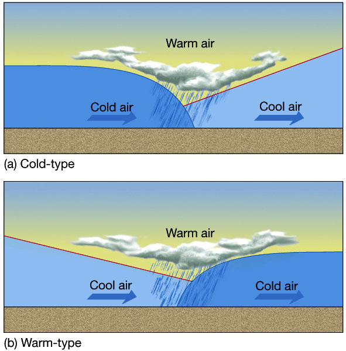

# Written Exam Notes

## Aerodynamics

### Categories
* Utility
  * Limited acrobatics and spins if approved
* Restricted
  * Cannot carry passengers or property for hire
* Primary
  * Cannot carry passengers or property for hire
* Limited
  * Cannot carry passengers or property for hire
* Experimental
  * Cannot carry passengers or property for hire

### Load Factor
* 60° bank: load factor of 2
* 80° bank: load factor of 5.76
* **Increase in airspeed decreases the rate of turn**
  * **Load factor remains constant**
  * **Radius of turn increases**

### Drag
* Lower airspeed results in more induced drag
* At high airspeeds, doubling airspeed quadruples parasite drag
* Warming or adding moisture to an air mass decreases its air density, which will decrease lift and drag

### Lift
* Lift proportional to square of aircraft's velocity
  * Increase airspeed 2x, lift increases 4x

### Stability
* Static stability
  * Positive: returns to original attitude when disturbed
  * Neutral: stays in new attitude when disturbed
  * Negative: continues moving away from original attitude when disturbed
* Dyanmic
  * Positive: oscillations dampen out over time
  * Neutral: oscillations never dampen out
* Negative: oscillations get worse over time

### Airspeed
* Maximum range airspeed decreases as weight decreases (i.e. as you burn gas through flight)

### Drag
* Parasite Drag
  * Form drag: aerodynamic resistance to motion due to shape of aircraft
  * Skin friction drag: smoothness or roughness of surfaces of the aircraft
  * Interference drag: occurs where surfaces with different characteristics meet (i.e. wing and fuselage)
* Induced drag
  * Secondary effect of the production of lift
* Wave drag
  * Comes into play when shock waves are developed close to the surface of the aircraft in transonic and supersonic flight

## Aircraft

### Weight and Balance
* See PHAK Chapter 10
* Gross weight
  * Total aircraft weight at any moment during flight or ground operation
* Standard Empty Weight / Empty Weight
  * Total weight of an aircraft including
    * Airframe
    * Engines
    * All fixed ballast
    * Unusable fuel
    * Full engine oil
    * Engine coolant
    * Hydraulic fluid
  * Excluding
    * Crew
    * Payload
    * Usable fuel
    * Drainable oil
  * Basic Empty Weight (BEW)
    * Standard Empty Weight plus weight of optional and special equipment installed
    * Includes full oil and operating fluids
* Licensed empty weight
  * Empty weight consisting of airframe, engines, unusable fuel, undrainable oil
  * Term used prior to GAMA standardization
* Maximum Allowable Zero Fuel Weight (MZFW)
  * Maximum allowable weight that can be carried in the fuselage
    * Eliminates possibility of destructive wing-bending stress
  * Maximum permissible weight of an aircraft with no disposable fuel or oil
  * Most an airplane can weigh when loaded with passengers and cargo with no usable fuel or oil on board
  * Basic operating weight plus payload
  * All weight over and above MZFW must be in the form of fuel in the wings
* Maximum Takeoff Weight (MTOW)
  * Maximum mass at which the aircraft is certified for takeoff due to structural or other limits
  * Does not vary with changes in temperature, altitude, runway length, etc.
* Maximum Permissible Takeoff Weight / Regulated Takeoff Weight
  * **Does** vary according to flap setting, altitude, temperature, length of runway
  * Cannot be higher than MTOW
* Minimum Flight Weight (MFW)
  * Minimum certificated weight for flight
* Maxmium Landing Weight (MLDW), or Regulated Landing Weight
  * Maximum mass at which the aircraft is certified for landing due to structural or other limits
  * **Does** vary with changes in temperature, altitude, runway length, etc.
* Maximum Ramp Weight (MRW), or taxi weight
  * Total weight of a loaded aircraft including all fuel
  * Greater than the takeoff weight to account for fuel burned during taxi and run-up
* Maximum weight
  * Maxmimum authorized weight of the aircraft and all equipment specified in the TCDS (type certificate datasheet)
* Fuel Load
  * Usabe fuel only (not in the lines or sumps)
* Basic Operating Weight (BOW)
  * Total weight of aircraft, including
    * Crew
    * Fixed ballast
    * Unusable fuel
    * Normal operating level of oil
    * Hydraulic fluid (transport aircraft only)
  * Excluding
    * Payload
    * Fuel
* Payload
  * Weight of occupants, cargo, and baggage
* Standard weights
  * 100LL: 6 lb/gal
  * Jet-A: 6.8 lb/gal
  * Oil: 7.5 lb/gal
  * Water: 8.35 lb/gal
* Arm is positive (+) if measured aft of datum and minus (-) if measured forward of datum

### Propeller
* Fixed-Pitch
  * Propeller pitch is fixed across the propeller
  * Designed for optimum pitch in an optimum setting
  * Any time the aircraft is not in the specific set of conditions that optimizes the pitch, propeller and engine efficiency is reduced
* Ground-Adjustable
  * Pitch can only be changed on the ground, i.e. not in flight
* Controllable-Pitch
  * Pitch can be changed inflight while it is turning
  * Blade angle can only be changed manually, i.e. by the pilot, **whereas** Constant-Speed propellers can change automatically
* Constant-Speed
  * [Article](https://www.boldmethod.com/learn-to-fly/aircraft-systems/how-a-constant-speed-prop-works/)
  * Speed up when engine dives and slows down when it climbs
  * Has a propeller governor that senses the aircraft engine’s speed and changes the blade angle of the propeller to maintain a specific RPM regardless of the aircraft’s operational conditions
  * **RPM will stay constant** even in climb or descent (which is *not* the case in a propeller, even a variable pitch one, that is not adjusted during flight)
  * Power output of the engine changes in accordance with alterations in the aircraft’s throttle setting
  * Decrease manifold pressure -> increases propeller blade angle -> increases drag -> decreases engine output
  * Small propeller angle of attack -> higher RPM
  * Increase throttle -> governor will increase propeller pitch to maintain a constant RPM
  * **Takeoff**
    * Want small angle of attack and high RPM
    * Airplane is at a low speed
    * Maximum power and thrust required
    * Thus, constant-speed propeller sets up a low propeller blade pitch
    * Keeps blade angle of attack with respect to relative wind small and efficient at the low speed
    * Propeller as a result handles a smaller mass of air per revolution
      * Allows engine to turn at maximum RPM and develop maximum engine power and thrust
      * Thrust is maximum at takeoff roll and decreases as airplane gains speed
* Manifold pressure gauge
  * [Article](https://www.askacfi.com/433/why-does-manifold-pressure-increase-during-a-prop-check.htm) and [article](https://www.avweb.com/flight-safety/technique/pelicans-perch-15manifold-pressure-sucks/)
  * Manifold pressure measures amount of vacuum developer in the instake manifold as the air is pulled through the filter, past the throttle plate, and across the manifold pressure gauge into the cylinders
  * Will read 12-13 inches at idle when atmospheric pressure is 30 inches
  * Reducing RPM during a magneto or prop check reduces sucking power of the cylinders; manifold pressure gauge thus moves UP towards ambient outside pressure, which is why manifold pressure gauge rises during a prop check
  * When engine is off, manifold pressure will read ambient pressure
  * Manifold pressure reads altimeter at sea level on a standard day
  * Subtract 1 inch per 1,000 feet to get expected engine off manifold pressure setting
    * Good pre-flight check to do to ensure manifold pressure gauge is reading properly
  * Most stress on an intake pipe is at idle
  * Why is there about an inch loss MP during a full-power runup?
    * Air filter, small area of wide-open throttle plate, and turns in ducting cost about an inch of MP
    * However, during takeoff and early climb, as airspeed builds, ram effect of airplane literally ramming more air into the induction system air intake regains some of this loss
    * Cruising at low altitude at 20 in MP/2000 RPM; pull RPM to 1200; MP will rise sharply because pistons are now pumping slower, thus not creating as much of a vacuum in the manifold, thus increasing pressure in manifold towards ambient air pressure
      * Less power being developed in spite of a higher RPM
      * Say you had increase RPM; in this case, MP would decrease
    * Higher MP at idle -> suspect an induction leak
* **In summary**
  * Takeoff: small angle of attack and pitch, high RPM
  * Cruise: large angle of attack and pitch, low RPM
  * Increase manifold pressure -> increase pitch to maintain RPM
  * Decrease manifold pressure -> decrease pitch to maintain RPM

## FARs
* Type rating required for > 12,500 pounds
* Cannot conduct a formation flight when carrying passengers for hire
* Serious injury: hospitalized within 7 days of accident for at least 48 hours
* Alcohol: 8 hours bottle to throttle AND BAC 0.04
* Acrobatic flight mins:
  * Cannot be in B, C, D, or E airspace designated for an airport
  * Cannot be within 4nm of the centerline of a federal airway
  * Cannot be conducted below an altitude of 1500 AGL
  * Cannot be conducted in less than 3sm flight visibility
* Class E towered: must contact tower within 4nm and under 2500 AGL

### Speed limits
* Above 10,000 MSL: Mach 1
* Below 10,000 MSL: 250kts
* Beneath Class B or through a VFR corridor in Class B: 200kts
* Within 4nm and under 2500 AGL of class C or D: 200kts
* Within 60nm of the DC VOR: 230kts
* Within the DC SFRA: 180kts

## Navigation

* VOT: should indicate 360 FROM (or 180 TO)
* 10 degrees either side of VOR center disk; 20 degrees total indicating capability
* Details about VFR waypoints can be found in the AFD/Chart Supplement
* **Time to station = (60 / # radials crossed) * elapsed time**

## Weather

* High: outwards, downwards, clockwise
* Low: inwards, upwards, counter-clockwise
* Temperature/dew-point convergence rate: **2.45C**
* Constant Pressure Analysis Chart
  * Can be used to find winds and temperatures aloft

